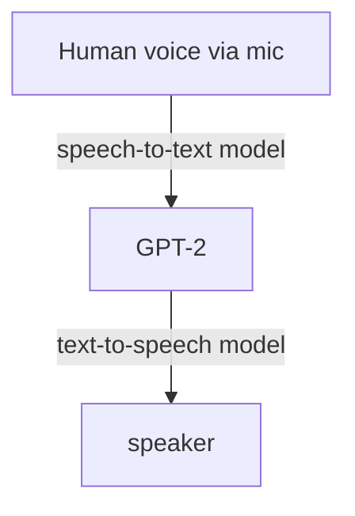

# Yuan

a gpt-2 model that can do speech-to-text and back again

the process flow would go like this:

```mermaid
graph TD
A[Human voice via mic] --speech-to-text model--> B[GPT-2]
B --text-to-speech model--> C[speaker]
```